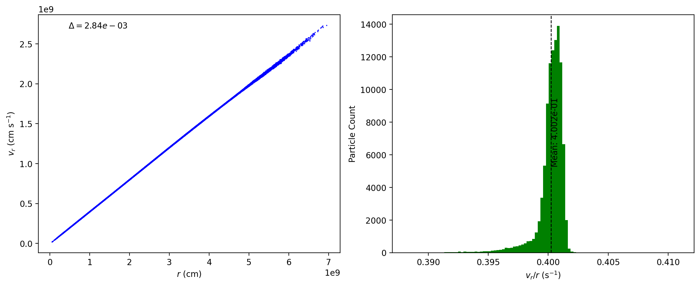
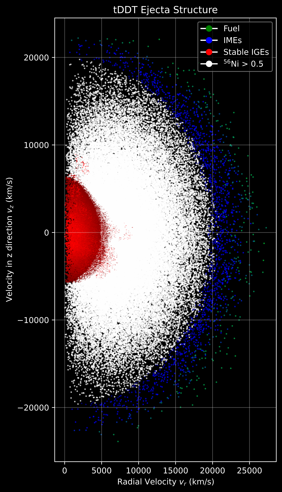

# SNIa_turbDDT_analysis
This repository contains the scripts for analysis and post-processing of the SNIa_turbDDT project. Refer to the documentation below for the post-processing workflow.

## FLASH
There are three progenitor models provided as of now in the turbDDT simulation directory of the flash43 repo. All three models are extensively tested for hydrostatic equilibrium. For all 3 progenitors, the virial theorem is noticed to be below 1×10<sup>-6</sup> at least for the first second, which is way past the detonation time for any tDDT ignition configuration. To know more on how to set-up the simulation and the information on available parameters for the tDDT model, read RUNS.txt provided in the simulation directory.

For job submission, 2 bash scripts are provided in the FLASH directory of this repo, `job.sh` and `jobWatchdog.sh`. I have noticed that the ibrun wrapper on Stampede3 sometimes does not allocate all the resources available to run the simulation; part of the resources are wasted being idle. I use the extended `mpiexec` command as described below to run my simulations. I have also noticed that the jobs on Stampede3 sometimes abruptly halt, and do not gracefully exit the job, wasting all the resources from that point onwards. I have implemented a watchdog on the particle file generation, as it is the most frequent part of I/O for our simulations. 1 thread at all times is assigned for the watchdog, and if any new particle file is not generated for 10 minutes, the watchdog cancels the job, saving resources. Although, after the Nov 2025 update, Stampede3 is much more stable than before, but I would recommend using the `jobWatchdog.sh` script on Stampede3.

```bash
scontrol show hostnames $HOSTLIST > hosts.txt
mpiexec -f hosts.txt -n <total number of processes> -ppn <processes per node> ./flash4
```

The first part of the command saves the list of allocated nodes in the hosts.txt file. The second command uses that file to execute the flash4 executable. You absolutely need to make sure that the -n and -ppn flags are set properly based on your node configurations for this to work. For Unity, you do not need this extended command. You can simply use `mpirun ./flash4`.

If you are running the jobs on interactive mode, you won't have the usual output or error file. To save the logs in that case, add the following lines after your executable.

```bash
... ./flash4 2>&1 | tee -a output.o
```
 
### Simulation Analysis
There are a number of analysis you can do on the simulation depending on your model, but the most common ones are looking at the important global quantities and the slice plots of key variables. To plot the combined evolution of the global quantities, you can use the `global_quantities.py` script. You will need to provide the correct path to your simulation's .dat file that saves the global quantities. Below is an example of some of the interesting quantities. Feel free to add more quantities in the script based on your needs.

<p align="center">
  
  <br>
  <em>Figure 1:</em>
</p>

<br>

The `sliceplots_mpi.py` script can be used to plot any plot file variables in a single image. You can simply write your plotting variables in the fields string and define the zoom settings you want for them using the width and widthLrat variable. If you add a new field, I would suggest you to add it in the configuration loop with your desired colormap and range if it's not already there, else yt will take care of it automatically by assigning the plain old viridis colormap with the maximum and minimum values available from the grid. Make sure to change the file path for to simulation's plt_cnt files. An example is provided below. Use the script with the following command.

```bash
mpirun -n <number of processes> python3 sliceplots_mpi.py
```

<p align="center">
  
  <br>
  <em>Figure 2: These are some slice plots on the y-z plane for the standard central density progenitor with 100 ignition point. The plot is at the onset of detonation at t = 0.3951 s after ignition. The top row is temperature, density and pressure zoomed in to show the full star, and the bottom row is length scale ratio L/L<sub>CJ</sub>, flame progress variable, and specific nuclear energy generation focused to show the turbulent flame. Based on the turbulent deflagration to detonation model, a successful detonation is achieved when the length scale ratio becomes greater then 1 within the thin flame front ( 1 x 10<sup>-3</sup> < flame < 1 x 10<sup>-2</sup> ).</em>
</p>

<br>

Before moving forward to calculating the nucleosynthetic yields using the TORCH code, you need to make sure that you ejecta is in free expansion. At this stage the radius (r) of any particle of the ejecta and its radial velocity (v<sub>r</sub>) are proportional to each other. Meaning at any radius (r), v<sub>r</sub>/r is a constant (s<sup>-1</sup>), sometimes referred to as the Hubble constant. You can confirm this using the `vr_vs_r.py` script. The script will calculate a quantity delta, defined as the standard deviation of v<sub>r</sub>/r normalised by the mean of v<sub>r</sub>/r, (Δ = σ(v<sub>r</sub>/r) / μ(v<sub>r</sub>/r)). Consider the ejecta to be in free expansion if Δ is < 0.01. I have noticed that about 2.5 s post explosion, the simulation reaches free expansion.

The script will also generate two plots, as given below. This calculation id done using the final particle file from your FLASH simulation. Before using the script, make sure you provide the correct path for it, and the correct column index for position x, y, z, and velocities in x, y, z direction.

<p align="center">
  
  <br>
  <em>Figure 3: The left plot is a scatter plot of v<sub>r</sub> vs r. It can be observed that the scatter plot draws a straight line in the v<sub>r</sub> vs r, representing that the radius is proportional to radial velocity. The delta variable being below 0.01 is an indication of that. The second plot shows the distribution of v<sub>r</sub>/r across particles. The vertical dashed line represents the mean v<sub>r</sub>/r</em>
</p>

## TORCH

### Post-processing Workflow
After the supernova ejecta has reached homologous expansion, follow the workflow below to calculate the nucleosynthetic yields and the synthetic spectra.

A thorough documentation for the initial modifications in the torch source code from [Pranav Dave](https://www.linkedin.com/in/pdave07/) and [Khanak Bhargava](https://www.linkedin.com/in/khanakb/) can be found here:

[TORCH: Initial Changes](https://novastella.org/wiki/index.php?title=Light_Curves_and_Spectra_of_Type_Ia_Supernovae_using_SuperNu#Loop_Torch_over_multiple_trajectories)

This repository contains some additional modifications in the torch source code as below:

- line 251: `tol = 1.0d-5`
- line 23412: `temp = max(5.0d8,min(temp,2.0d10))`

The first change was made after doing a convergence study on the TORCH yields. The study can be found in `TORCH/convergence` in this repo. The second change is specifically for the single degenerate model, where temperatures can reach higher than 1 x 10^9 K. At such high temperatures, the TORCH calculations become invalid. Temperatures near 1 x 10^9 K are enough to reach nuclear statistical equilibrium (NSE) before the ejecta cools down, even for our highest central density progenitor. This change adds a ceiling to the temperature. This change adds a ceiling to the temperature values.

File structure:

```
TORCH/
├── convergence/
├── scripts/
└── src/
```

### 1. Trajectory Generation
First, create a new directory in the TORCH directory named `history`. Copy the `create_traj.py` script into this history directory.

The particles files from your FLASH simulation consists the data from your constant mass Lagrangian tracer particles. These particles simply tracks the evolution of temperature, density, pressure, and some other quantities like Y_e fraction, flame progress variable, etc. It also has the location and velocity of the particle in the 3D Cartesian grid and the tags of each particle. The tag of the particle never change during the simulation. You can use it if you need to analyse individual particles. Before running the script, you must update it to match your simulation data:

- Change the path of the particle file to point to your FLASH simulation's **final particle file**.
- Update the column indices for **temperature, density, and particle tag** to match your particle file structure.

**Tip:** You can use the `test.py` script to check the structure of your particle files and its contents.

Once configured, run the script:

```bash
python3 create_traj.py
```

This is a serial code that reads all particle files and writes the temperature and density trajectories. The trajectories will be named after the tags of the particles. So if you have say 100000 particles, you should have 100000 trajectories. The process should not take longer than 2 hours.

**Note:** If you encounter memory issues, use the `create_traj_mpi_restartable.py` script instead. You will need to update the column indices and file paths in this script as well. Execute it using the number of processes available to you. You can also increase the number of nodes to increase memory.

### 2. Compilation
Navigate to the `src` directory. Open `torch.f` and go to line 17460. Change the path for the trajectory files to point to your history directory.

Ensure the compiler in the Makefile matches your system's configuration. Based on your machine, you might need to choose between the compilers `ifort` and `gfortran`. Compile the code:

```bash
make
```

This will generate the `torch` executable.

### 3. Execution
Copy the `runTORCHmpi.py` script to the src directory. Update the following before running the script:
 - total number of particles

**Note:** This number might vary slightly between runs even with the same progenitor. You can find the total count in the log file or by checking the particle files with `test.py`. Make sure you update the column for tag based on your data structure.

Run the script using MPI:

```bash
mpirun -n <number of processes> python3 runTORCHmpi.py
```

**Scalability and Restartability:** TORCH is inherently a serial code. The `runTORCHmpi.py` script processes one trajectory per MPI thread, making the execution embarrassingly parallel and almost 100% scalable. This script uses mpi4py for parallelization. You can try OpenMP with a C code to create an executable for running TORCH in parallel. It's a better option then MPI

If all particles are not processed in a single job submission, simply resubmit the job without changes. The script checks the output files and automatically compiles a list of unprocessed trajectories to handle in the subsequent run.

After all the trajectories are processed, you will have `out_<tag>_final.dat` files for each trajectory associated with its particle tag. The shape of each file should be the same, containing 489 rows representing 489 isotopes, and 4 columns representing baryon number, atomic number, mass fraction, and the name of the isotope. These are your final nucleosynthetic yields. The sum of all mass fractions for each final file should be equal to 1.

### 4. Analysing the yields
Use the `average.py` script to calculate the total final yields, which simply calculates the average yields from all the trajectories and outputs the data in the `meanAbundances.dat` file. Change the path for the final TORCH output to your TORCH run, and change the total mass of your ejecta to get accurate calculations in solar mass. Run the script with the following command:

```bash
mpirun -n <total processes> python3 average.py
```

<br>

- There are multiple ways you can visualize the ejecta structure. The most common method is to plot the mass fraction of individual isotopes against radial velocity. You can use the `structure.py` script for that. It converts the ejecta from 3D Cartesian space into 1D Spherical space, and then maps it into a velocity mesh, which allow us to clearly analyse the stratification of the ejecta. Before using this script, make sure you have provided the correct paths for your final particle file from FLASH simulation, and your TORCH run for that simulation. Also adjust the column indices for position x, y, z; velocity vx, vy, vz and the particle tag. Choose the isotopes you want to plot by adding them in the isotopes array. Execute the script using the following command.

```bash
mpirun -n <total processes> python3 structure.py
```

<p align="center">
  
  <br>
  <em>Figure 4: The plot above is for a standard central density progenitor. This is the simplest and most effective way to visualise the ejecta structure. Since the ejecta has reached free expansion, we can analyse the position of the products of the explosion from its radial velocity. As seen in the plot, we can clearly see a Ni56 hole inside the core, dominated by the stable iron group elements (IGEs) (orange and pink curve below 5000 km/s) and some trace of Mn55 (green curve). These are the products of high neutronization due to sufficient electron capture inside the core of the White Dwarf. This happens because of high density (>1×10⁹ g/cm³) nuclear burning. Beyond the core of the White Dwarf, in the low-density environments (1×10⁹ to 1×10⁸ g/cm³), electron capture is negligible, and the resulting nucleosynthesis is dominated almost exclusively by Ni56 (blue curve between 5000 km/s to 20000 km/s), the most abundant products of NSE. This particular isotope is responsible for the bright nature of the SNe Ia. The final layer of the ejecta are intermediate mass elements (IMEs) like Si28 and S32 (red and purple curve above 20000 km/s), which are the products of Quasi-Statistical Equilibrium (QSE) or incomplete burning in lower density material (<1.2×10⁷ g/cm³), and unburnt C/O. We can also see a faint layer of Ca40 (brown curve) between the Ni56 and Si28.</em>
</p>

<br>

- You can also use the `2D_cylindrical_structure.py` script to visualise the structure. This script plot IGEs, unburnt C/O, and IMEs in RGB fashion, and ni56 > 0.5 in strict white, so brown, for example, would mean the particle has mostly IGEs and some unburnt C/O. This is a more visually appealing approach as the plot is in a 2D cylindrical velocity space. The x-axis is radial velocity and y-axis is the velocity in z direction. Again, make sure you have provided the correct paths for your final particle file from FLASH simulation, and your TORCH run for that simulation. Also adjust the column indices for position x, y, z; velocity vx, vy, vz and the particle tag. Choose the isotopes you want to plot by adding them in the isotopes array. Execute the script using the following command.

```bash
mpirun -n <total processes> python3 2D_cylindrical_structure.py
```

<p align="center">
  
  <br>
  <em>Figure 5: This is the scatter plot of all the 100000 Lagrangian tracer particles are in 2D cylindrical velocity space, color coded with the abundance of different isotopes. You can clearly see the core of the ejecta dominated by stable IGEs (red), then for the most part radioactive Ni56 (white), and the outermost layer dominated by IMEs line Si28 and S32 (blue) with some trace of unburnt fuel (green).</em>
</p>

<br>

- An alternative to the 2D cylindrical plot is to visualize the structure in an interactive 3D plot. You can use the `interactive_structure.py` script for that. This script outputs an HTML file containing an interactive plot of all the particles in a 3D velocity space. Similar to the 2D cylindrical plot, this plot contains IGEs, unburnt C/O, and IMEs in RGB fashion, and ni56 > 0.5 in strict white. Before running the script, make sure your paths for the final particle file from the FLASH simulation and the corresponding TORCH run are correct. Also, change the column index for velocities and tag according to your data. This script is also executed with mpirun.

```bash
mpirun -n <total processes> python3 interactive_structure.py
```

<a plot showing sample 3D structure plot with description.>

## SuperNu
This next stage of the pipeline is calculating the synthetic light curve using SuperNu. Before moving forward, go through the documentation in the link provided below to setup SuperNu for both serial and parallel mode. There are also sample data available for the classic W7 model for Type Ia supernovae originally developed by Nomoto, Thielemann, and Yokoi in 1984. You can use that to test your SuperNu installation.

[SuperNu: Code Setup Instructions](https://novastella.org/wiki/index.php?title=Light_Curves_and_Spectra_of_Type_Ia_Supernovae_using_SuperNu#Code_Setup_Instructions)

Once everything is set up, you will have to convert the TORCH output yields into a SuperNu input string. This is a two-stage process. SuperNu accepts elemental abundances rather than isotopic abundances.

### 1. Isotopic to Elemental Conversion
The first stage is to convert the isotopic abundances into elemental abundances. Provide the path to your TORCH run in the `isotopicToElemental_mpi.py` script, and run it with the following command:

```bash
mpirun -n <number of processes> python3 isotopicToElemental_mpi.py
```

This will create a directory named `elemental` where you execute the script, and save the converted elemental abundances for all the trajectories from your TORCH run in it.

### 2. Generating Input String
Once this stage is complete, open the `Torch_to_Supernu.py` script, and change the following:

- Path to your final particle file from the FLASH simulation
- Path to your elemental abundance data
- Path to your TORCH run
- Final mass of your ejecta, which can be found in the global data of your FLASH run
- Total number of particles in your FLASH simulation
- Column index for position x, y, z; velocity vx, vy, vz and tag based on your particle file data structure

You can adjust the number of bins for the input string for SuperNu according to your needs. The default 128 bins provide sufficient resolution without making the SuperNu runs unnecessarily expensive. Run the script with the following command:

```bash
mpirun -n <number of processes> python3 Torch_to_Supernu.py
```

Once the script is done, you will get `input.str` as an output. This file will have 51 columns. The first two columns are the velocity of the right edge of the bins and mass, followed by the elemental abundances from hydrogen (h) to technetium (tc). The last 6 columns are Ni56, Co56, Fe52, Mn52, Cr48, and V48. SuperNu only includes the unstable alpha-chain isotopes Ni56, Fe52, and Cr48, and the products of their decay chain. Thus, only these isotopes are included in the input string.

### 3. Calculating Spectra
You can now use the `input.str` to calculate the synthetic spectra. There is a sample `input.par` parameter file provided in the `SuperNu/sample` directory. This sample file is configured for 1D spherical geometry with 128 bins, which you have. When you run SuperNu, it will calculate the total mass of the ejecta and the Ni56 mass. If everything went well, these masses will match your FLASH simulation and the TORCH output.

## SNID
The Supernova Identification Code, short for SNID, is made by Stephane Blondin for classification of the spectra. It is the same tool used by observers. We will use it to classify our synthetic spectra to observed events.

From the SuperNu run you will get multiple files as an output. The ones you need for this stage of the pipelines are `output.flx_grid` and `output.flx_luminos`. The `flx_luminos` file contains the spectral flux for each timestep of the SuperNu run. The `flx_grid` file contains the wavelength grid for the flux and the epoch or timestep that corresponds to the rows of the luminos file. These timesteps can be considered as fractional epochs of the synthetic spectra.

### 1. Preparing Spectra
We will use the script `SuperNu_to_SNID_v2.0.py` written by [Mckenzie Ferrari](https://www.linkedin.com/in/mckenzie-ferrari/). Execute the script with this command:

```bash
python3 SuperNu_to_SNID_v2.0.py
```

Upon execution, you will be prompted with these two questions:

```
Enter file name for WAVELENGTHS (i.e. __grid):
Enter file name for FLUX/LUMINOSITY (i.e. __luminos):
```

To which you will provide the location of the `flx_grid` and `flx_luminos` file of your SuperNu run. The script will then calculate the epoch for peak brightness and prompt you with the following:

```
Peak brightness found at LINE xx out of yy
Would you like to use this line at peak brightness? (Y/n):
```

Answer with 'Y' if you want the spectra for the epoch with peak brightness, and 'n' if you want the spectra for some other epoch. Read the `flx_grid` file to see which line corresponds to which fractional epoch. Once done, it will ask you to provide a name of your output file, to which you can input the name according to your epoch choice.

### 2. Building SNID
Now that you have the spectra you want to classify, you will have to build SNID first. Dr. Robert Fisher has made a very easy to use docker version of the SNID code. The link to that repository is provided below.

[https://github.com/rtfisher/snid_docker](https://github.com/rtfisher/snid_docker)

Follow the instructions there to build SNID on your device. Once done, you can run SNID in a local directory containing your spectra. Once you're in SNID, edit the `snidmore.f` code in the source directory to change the path of the template directory to yours. It will have the path for Dr. Blondin's device by default. Then follow the commands below to remake SNID.

```bash
make clean
make
make install
```

### 3. Running SNID
That's it! You can now classify your synthetic spectra using SNID. You can use the base command below to run SNID.

```bash
./snid forcez=0.0 wmin=2500 wmax=10000 ./localdir/your_spectra.dat
```

`forcez=0.0` is an important flag used to force the redshift of the synthetic spectra to 0. SNID will prompt you with a question `Do you want to enter a new redshift ? ( y / n ) [ n ]:` if you don't add the flag beforehand. You can enter 'y' and set the redshift to 0.0 later.

`wmin` and `wmax` flags are used to set bounds of the wavelength of the spectra. Almost all the observed spectra are in the range of 2500 to 10000 Angstrom, so this is a safe choice.

If your synthetic spectra matches any observed events with `rlap > 5`, it will open a pgplot window where you can see the respective matches of your model with the observed events in the template. If not, you will be prompted with:

```
Enter a new (1) redshift; (2) zfilter; (3) rlapmin; (4) lapmin; or (q)uit:
```

You should choose number 3, and set rlap to a lower value, e.g., 3.0.

To extract any matches, you can either click the PS button which will save the image as a .ps file, or click the ASCII button that will save the matching event as a data file. You can later use these data files to make combined plots of multiple spectra. By default, when you run snid for any synthetic spectra, it will generate a data file containing the information on all the events in the template directory and how it compares against your synthetic spectra. You can use it to check the rlap score for any observed event. A match is a good match if `|z - zuser| < zfilter`, where z is the redshift of the observed event and zuser is the redshift of your synthetic spectra (0.0). zfilter is set to 0.02 by default.

### Troubleshooting
If you come across any errors while saving the ps file, considering these drivers in your driver list in the source code, and rebuild it using the make commands given above.

```
AQDRIV 0 /AQT       AquaTerm.app under Mac OS X             C        <=== ONLY FOR MAC OSX!
GIDRIV 1 /GIF       GIF-format file, landscape
GIDRIV 2 /VGIF      GIF-format file, portrait
LXDRIV 0 /LATEX     LaTeX picture environment
PSDRIV 1 /PS        PostScript printers, monochrome, landscape  Std F77
PSDRIV 2 /VPS       Postscript printers, monochrome, portrait   Std F77
PSDRIV 3 /CPS       PostScript printers, color, landscape   Std F77
PSDRIV 4 /VCPS      PostScript printers, color, portrait    Std F77
TTDRIV 4 /GTERM     GTERM Tektronix terminal emulator       Std F77
TTDRIV 5 /XTERM     XTERM Tektronix terminal emulator       Std F77
WDDRIV 1 /WD        X Window dump file, landscape
WDDRIV 2 /VWD       X Window dump file, portrait
XWDRIV 1 /XWINDOW   Workstations running X Window System    C
XWDRIV 2 /XSERVE    Persistent window on X Window System    C
```

You can check out the complete documentation of SNID from the link below:

[SNID documentation](https://people.lam.fr/blondin.stephane/software/snid/howto.html)
